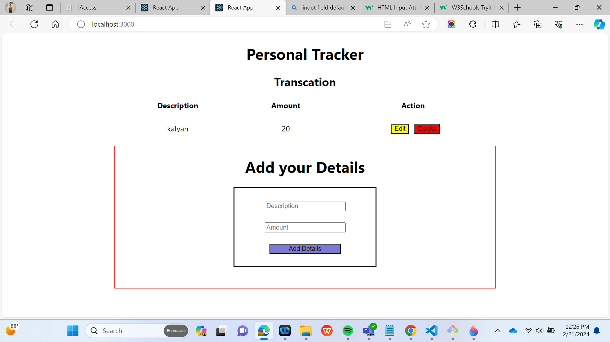

insatll npm module
cd my-app
npm start

here i have create a tracker application,in this i have use the hooks

enter the fileds name and amount ,and you will get a details
there you can edit it and delete the details.

